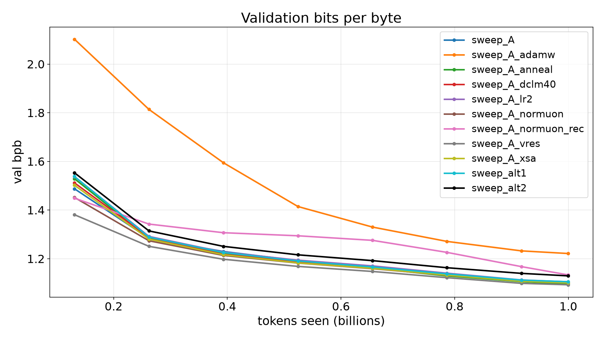

# gibc-v2-lm: a 49.8M-parameter language model trained from scratch

Submission for the Global Innovation Build Challenge V2, Track 01 (TECH, foundational LLM development).

We train a 14-layer decoder-only transformer with 49,822,228 trainable parameters from random initialisation on 20B tokens of openly licensed English web, maths, PDF and Wikipedia text, using our own 32k BPE tokenizer. The recipe is the modded-nanogpt family of speedrun techniques (Muon, QK-norm, ReLU², U-net skips, logit softcap) plus a ResFormer value residual, a warmup-stable-decay schedule, and a quality-data anneal during the decay phase. Every design choice that made it into the main runs was tested first in an 12-arm, 1B-token ablation sweep, reported in full below. Training data is decontaminated against WikiText-103 validation and test at the document level before tokenization. A main run takes about 8 hours on one H100.

Everything in this repository was written by AI coding agents under human direction. See [AI use disclosure](#ai-use-disclosure).

## Headline results

Final numbers for the two 20B-token main runs. "final" is the weights after the last step; "avg" is the elementwise mean of the last 4 decay-phase snapshots (250 steps apart).

| | main_vres_anneal | main_vres_mild |
|---|---|---|
| HellaSwag acc_norm | {{MAIN_ANNEAL_HELLASWAG}} | {{MAIN_MILD_HELLASWAG}} |
| ARC-Easy acc / acc_norm | {{MAIN_ANNEAL_ARCE}} / {{MAIN_ANNEAL_ARCE_N}} | {{MAIN_MILD_ARCE}} / {{MAIN_MILD_ARCE_N}} |
| PIQA acc / acc_norm | {{MAIN_ANNEAL_PIQA}} / {{MAIN_ANNEAL_PIQA_N}} | {{MAIN_MILD_PIQA}} / {{MAIN_MILD_PIQA_N}} |
| WinoGrande acc | {{MAIN_ANNEAL_WINO}} | {{MAIN_MILD_WINO}} |
| WikiText-103 test word ppl, lm-eval-style windows | {{MAIN_ANNEAL_LMWT_WPPL}} | {{MAIN_MILD_LMWT_WPPL}} |
| WikiText-103 test word ppl, stride 512 | {{MAIN_ANNEAL_WT_WPPL}} | {{MAIN_MILD_WT_WPPL}} |
| WikiText-103 test bits/byte, stride 512 | {{MAIN_ANNEAL_WT_BPB}} | {{MAIN_MILD_WT_BPB}} |
| Held-out val bits/byte | {{MAIN_ANNEAL_VAL_BPB}} | {{MAIN_MILD_VAL_BPB}} |
| Weights reported | {{MAIN_ANNEAL_VARIANT}} | {{MAIN_MILD_VARIANT}} |
| H100 hours | {{MAIN_ANNEAL_GPU_HOURS}} | {{MAIN_MILD_GPU_HOURS}} |

Submitted model: **{{MAIN_SUBMITTED_RUN}}** ({{MAIN_SUBMITTED_VARIANT}} weights). All benchmarks are zero-shot on the full evaluation sets (no `--limit`). Standard errors are about ±0.45 points on HellaSwag, ±1.0 on ARC-Easy, ±1.1 on PIQA and ±1.4 on WinoGrande. Raw JSON: {{MAIN_EVAL_JSON_PATHS}}.

Training curves: {{MAIN_CURVES_PNG}}.

## Architecture

Config `A_vres` in [`gibc/configs.py`](gibc/configs.py), model in [`gibc/model.py`](gibc/model.py).

| | |
|---|---|
| Layers | 14, pre-norm (RMSNorm, eps 1e-6), no biases anywhere |
| Width | d_model 512 |
| Attention | 8 query heads of dim 64, 4 KV heads (grouped-query attention), causal, via `F.scaled_dot_product_attention` |
| Position | RoPE, base 10,000, on Q and K |
| QK-norm | RMS-normalise Q and K per head before RoPE, no learnable weight |
| MLP | 512 -> 1536 -> 512, ReLU² activation |
| Value residual | every layer after the first attends with `λ_l · V_l + (1 - λ_l) · V_0`, where V_0 is layer 0's values; one learned λ per layer, init 0.5 (ResFormer) |
| U-net skips | output of layer i is added (times a learned scalar, init 1) to the input of layer 13 - i, for i < 7 |
| Embedding | 32,768 x 512, tied: the same matrix embeds tokens and projects to logits |
| Output | final RMSNorm, logits = `15 · tanh(logits / 15)` (softcap) |
| Context | 1,024 tokens |
| Init | embedding N(0, 0.005), Wq/Wk/Wv/W_up N(0, 0.02), Wo and W_down zero |

### Parameter count

`uv run python scripts/count_params.py` prints the count for every config (it builds the model on the meta device and sums `p.numel()` over `model.parameters()`):

```
"A_vres": {
  "once": 49822228,
  "twice": 66599444,
  "embedding": 16777216,
  "non_embedding": 33045012,
  "under_cap_once": true,
  "under_cap_twice": false
}
```

The same arithmetic by hand:

| Component | Shape | Parameters |
|---|---|---|
| Token embedding / output head (tied) | 32768 x 512 | 16,777,216 |
| Wq, Wo (per layer) | 2 x 512 x 512 | 524,288 |
| Wk, Wv (per layer) | 2 x 512 x 256 | 262,144 |
| W_up, W_down (per layer) | 2 x 512 x 1536 | 1,572,864 |
| Two RMSNorm weights (per layer) | 2 x 512 | 1,024 |
| **One layer** | | **2,360,320** |
| 14 layers | | 33,044,480 |
| U-net skip scalars | 7 | 7 |
| Final RMSNorm | 512 | 512 |
| Value-residual λ | 13 | 13 |
| **Total trainable** | | **49,822,228** |

That is 177,772 under the 50,000,000 cap. The rules count "total trainable parameters", including token embeddings and the output head. Here those are one tensor: the head reads `wte.weight` directly, there is no separate head matrix, and the optimizer updates 49,822,228 numbers. That count includes both the embedding and the head. If the tied matrix were counted twice, once as embedding and once as head, the total would be 66,599,444. We report both so the judges can apply either convention. The only swept config under 50M on both counts is `alt2` (16k vocabulary, 41,433,607 unique / 49,822,215 counted twice), which scored lower (see the ablation table).

## Training recipe

Code: [`gibc/train.py`](gibc/train.py), [`gibc/optim.py`](gibc/optim.py), [`gibc/data.py`](gibc/data.py).

- **Optimizers.** Muon (`torch.optim.Muon`, Nesterov momentum 0.95, 5 Newton-Schulz steps, `adjust_lr_fn="original"`) on the 84 two-dimensional matrices inside the blocks, lr 0.02, decoupled weight decay 0.01. AdamW (betas 0.9/0.95, no weight decay, fused) on everything else: the embedding, norm weights, skip scalars and value-residual λ, lr 3e-3. Gradient norm clipped to 1.0.
- **Schedule.** Warmup-stable-decay: linear warmup over the first 1% of steps, constant, then linear decay to exactly 0 over the last 35%.
- **Batch.** 524,288 tokens per step (64 sequences x 8 accumulation steps x 1,024 tokens). A 20B-token run is 38,146 steps: 381 warmup, decay from step 24,795.
- **Precision and speed.** bf16 autocast, `torch.compile`, TF32 matmuls, single GPU.
- **Documents.** Each document is prefixed with `<|bos|>`, the only delimiter. Sequences are 1,024-token windows of the concatenated stream, so attention crosses document boundaries.
- **Data mix switch.** When the LR decay starts, the loader switches from the main mix to an anneal mix of higher-quality data.
- **Checkpointing.** Full state every 30 minutes with exact resume (loader cursors and RNG included), plus model-only snapshots every 250 steps during the decay for weight averaging.
- **Validation.** Exact bits per byte every 250 steps on held-out documents from the main-mix sources, taken from parquet files no training shard uses.

### Data mixes

The loader allocates the 64 rows of each micro-batch across sources by integer rows, so realised fractions differ slightly from the nominal weights in `configs.py`. Token counts are for a 20B-token main run.

| Phase | Mix (nominal) | Rows per 64 | Tokens |
|---|---|---|---|
| Main, steps 0-24,794 (both runs) | FineWeb-Edu 60%, DCLM 30%, FineMath 5%, FinePDFs 5% | 39 / 19 / 3 / 3 | 13.0B |
| Decay, `main_vres_anneal` | FineWeb-Edu int_score>=4 60%, FineMath 22.5%, FineWeb-Edu 7.5%, DCLM 5%, Wikipedia 5% | 38 / 15 / 5 / 3 / 3 | 7.0B |
| Decay, `main_vres_mild` | FineWeb-Edu int_score>=4 40%, FineMath 20%, FineWeb-Edu 20%, DCLM 15%, Wikipedia 5% | 26 / 13 / 13 / 9 / 3 | 7.0B |

"FineWeb-Edu int_score>=4" (`fwedu_hq`) is drawn from 60 parquet files disjoint from those used for plain FineWeb-Edu, and validation documents come from a third, separate file, so no document appears in two splits.

The two main runs share the model, seed, schedule and main-phase mix, and differ in how strongly the anneal leans on curated data. They do not see identical main-phase documents: `main_vres_anneal` was launched before the FineWeb-Edu and DCLM shards were extended (99 to 108 and 68 to 77 shards), and the loader's shuffled shard order depends on the shard count, so the two runs read those sources in different orders. The 1B sweep found that the strong anneal (`sweep_A_anneal`, no Wikipedia) helped ARC-Easy and hurt PIQA; the mild variant keeps about 35% general web text to test whether the PIQA loss can be avoided.

## Data

No pretrained weights or pretrained tokenizer are used. No LLM-generated or synthetic corpus is used. All sources are public Hugging Face datasets; each licence below was checked against the dataset card on 2026-09-26.

| Source | Hugging Face dataset (subset) | Licence | Used for |
|---|---|---|---|
| FineWeb-Edu | [HuggingFaceFW/fineweb-edu](https://huggingface.co/datasets/HuggingFaceFW/fineweb-edu) (`sample/100BT`) | ODC-By 1.0; use also subject to Common Crawl's Terms of Use | main mix; int_score>=4 subset in the anneal |
| DCLM-baseline | [mlfoundations/dclm-baseline-1.0-parquet](https://huggingface.co/datasets/mlfoundations/dclm-baseline-1.0-parquet) (`filtered/`) | CC-BY-4.0 | main mix, anneal |
| FineMath | [HuggingFaceTB/finemath](https://huggingface.co/datasets/HuggingFaceTB/finemath) (`finemath-4plus`) | ODC-By 1.0; use also subject to Common Crawl's Terms of Use | main mix, anneal |
| FinePDFs | [HuggingFaceFW/finepdfs](https://huggingface.co/datasets/HuggingFaceFW/finepdfs) (`eng_Latn`) | ODC-By 1.0; use also subject to Common Crawl's Terms of Use | main mix |
| English Wikipedia | [wikimedia/wikipedia](https://huggingface.co/datasets/wikimedia/wikipedia) (`20231101.en`) | CC-BY-SA 3.0 and GFDL | anneal only (5%) |
| WikiText-103 | [Salesforce/wikitext](https://huggingface.co/datasets/Salesforce/wikitext) (`wikitext-103-raw-v1`) | CC-BY-SA 3.0 and GFDL | evaluation only; decontamination reference |

**Tokenizer.** Byte-level BPE with 32,768 entries, trained with Hugging Face `tokenizers` on a 3 GB text sample: 85% in main-mix proportions, 15% FineWeb-Edu int_score>=4. Pre-tokenization uses the Llama 3 split regex. Special tokens `<|bos|>`, `<|eos|>` and `<|pad|>` are ids 0-2. A 16,384-entry tokenizer was trained on the same sample for the `alt2` ablation. Code: [`gibc/tokenize.py`](gibc/tokenize.py), [`modal_data.py`](modal_data.py).

### Decontamination

WikiText-103 is built from Wikipedia articles, and those articles are also mirrored across the web. Before any filtering, a 250M-token sample of our tokenized training shards contained 4.96% of the distinct WikiText-103 test 13-grams. They came from 6 of the 182,375 documents scanned, all of them copies of Wikipedia article text. Left in, those documents would lower test perplexity through memorisation rather than modelling, so we filter at tokenization time ([`gibc/decontam.py`](gibc/decontam.py)):

1. **Normalisation.** Text is lowercased and split into runs of `[a-z0-9]`. N-grams are over these words, not tokens, so the check does not depend on the tokenizer and is robust to WikiText's spaced punctuation (` @-@ `, ` , `).
2. **13-gram filter, all sources.** Every training *and validation* document, from every source, that shares at least one 13-gram with WikiText-103 validation + test is dropped whole.
3. **Title filter, Wikipedia only.** Wikipedia articles whose normalised title matches a WikiText-103 validation or test article title are dropped whether or not they share a 13-gram.
4. **Accounting.** Drop counts are recorded per shard (`n_docs_dropped_title`, `n_docs_dropped_ngram`) and summed per source in the manifest status.

Totals for the 32k-tokenizer shards, from the data manifest: 4,969 documents dropped by the 13-gram filter (FineWeb-Edu 2,986, FineWeb-Edu int_score>=4 420, DCLM 424, FineMath 6, FinePDFs 8, Wikipedia 1,107 training and 18 validation) and 16 Wikipedia articles dropped by title. Because the filter and the overlap report use the same normalisation and 13-grams, no remaining document shares a 13-gram with WikiText-103 validation or test; we did not rerun the sample report on the filtered shards.

The four multiple-choice benchmarks are **not** filtered. `modal_data.py::decontam_bench` reports their 13-gram overlap with a 300M-token sample of the filtered training shards (the first shard of each of the six sources, 219,831 documents). An item counts as hit if any 13-gram of its context joined with a candidate answer appears in the sample ([`results/decontam_bench.json`](results/decontam_bench.json)):

| Benchmark | Items hit | Matched 13-grams |
|---|---|---|
| HellaSwag | 3 / 10,042 | 59 / 1,288,878 |
| ARC-Easy | 1 / 2,376 | 4 / 46,493 |
| PIQA | 2 / 1,838 | 57 / 40,376 |
| WinoGrande | 0 / 1,267 | 0 / 13,692 |

The matched text is generic how-to and textbook phrasing: WikiHow-style instructions for HellaSwag, a sentence about deflection in the northern and southern hemispheres for ARC-Easy, and the area of a triangle for PIQA. The full training set is about 80 times larger than the sample, so the absolute counts are likely higher.

## 1B-token ablation sweep

Every arm is Config A (the architecture above without value residual) trained for 1B tokens (1,907 steps, same schedule shape) with one change. Each arm is a single seed. All evaluations are zero-shot on the full sets. Raw data: [`results/sweep_1B/eval_table.csv`](results/sweep_1B/eval_table.csv), `results/sweep_1B/*_final_eval.json`, training logs in `results/sweep_1B/logs/`.

| Run | Change vs `sweep_A` | HS acc_n | ARC-E acc | ARC-E acc_n | PIQA acc | PIQA acc_n | Wino acc | WT ppl (s512) | WT bpb (s512) | WT ppl (lm-eval) | val bpb |
|---|---|---|---|---|---|---|---|---|---|---|---|
| sweep_A | baseline | 28.87 | 46.46 | 41.67 | 61.53 | 58.87 | 52.09 | 57.17 | 1.0916 | 64.05 | 1.1020 |
| **sweep_A_vres** | + value residual | 28.71 | 47.18 | 40.87 | 60.83 | 58.81 | 50.04 | **53.95** | **1.0760** | **60.57** | **1.0931** |
| sweep_A_xsa | + Exclusive Self Attention | 28.33 | 46.51 | 40.91 | 59.25 | 59.41 | 53.20 | 55.93 | 1.0856 | 62.60 | 1.1010 |
| sweep_A_normuon | NorMuon + cautious WD | 28.45 | 47.60 | 42.42 | 60.94 | 59.03 | 51.46 | 55.93 | 1.0857 | 62.53 | 1.1019 |
| sweep_A_normuon_rec | NorMuon, lr 0.023, wd 1.2 | 28.18 | 45.16 | 40.95 | 60.12 | 58.98 | 51.38 | 61.70 | 1.1122 | 69.27 | 1.1336 |
| sweep_A_lr2 | Muon lr 0.04 | 28.33 | 46.89 | 40.87 | 60.28 | 59.25 | 51.46 | 56.94 | 1.0905 | 63.68 | 1.1053 |
| sweep_A_adamw | AdamW on all params | 27.38 | 42.55 | 37.75 | 57.67 | 56.91 | 49.49 | 88.98 | 1.2109 | 98.68 | 1.2215 |
| sweep_A_anneal | quality anneal in decay | 28.22 | **47.98** | **43.14** | 58.81 | 58.05 | 52.72 | 58.51 | 1.0978 | 65.64 | 1.0965 |
| sweep_A_dclm40 | main mix 50% FW-Edu / 40% DCLM | 28.44 | 45.92 | 40.53 | 60.07 | 58.38 | 52.41 | 56.32 | 1.0875 | 63.14 | 1.1020 |
| sweep_alt1 | d576, 8 blocks each applied twice | 28.17 | 46.59 | 41.29 | 60.28 | 58.76 | 52.72 | 56.79 | 1.0898 | 63.47 | 1.1054 |
| sweep_alt2 | 16k vocabulary | 28.16 | 44.15 | 39.69 | 58.00 | 58.38 | 51.62 | 58.35 | 1.0971 | 65.76 | 1.1296 |

Accuracies are in percent. "WT" is WikiText-103 test, word-level perplexity and bits per byte, with a sliding window of stride 512 (s512) or lm-eval-style disjoint windows (see [Evaluation](#evaluation-protocol)). "val bpb" is on our held-out validation documents; for alt2 it is measured with its own tokenizer, but bits per byte is comparable across tokenizers.

Curves, all arms overlaid: [training loss](results/sweep_1B/train_loss.png), [validation bpb](results/sweep_1B/val_bpb.png), [throughput](results/sweep_1B/tok_per_s.png). Train loss is not comparable across arms that change the data (anneal, dclm40) or the tokenizer (alt2). Use val bpb and WikiText for those.



### What we concluded, and how sure we are

One standard error is about 0.45 points on HellaSwag, 1.0 on ARC-Easy, 1.1 on PIQA and 1.4 on WinoGrande. With one seed per arm, any benchmark difference under about 2 points (3 on WinoGrande) is indistinguishable from noise. Perplexity and bits per byte are much less noisy (WikiText-103 test is 241k words), so they carry most of the weight in these decisions.

- **Muon beats AdamW by a wide margin.** AdamW is worse on every metric (WikiText ppl 89.0 vs 57.2). This is the one unambiguous benchmark result.
- **Value residual: kept.** It gives the largest perplexity gain in the sweep (WikiText ppl 57.2 -> 54.0, val bpb 1.1020 -> 1.0931) for 13 parameters. Benchmarks are flat within noise. WinoGrande is 2.1 points lower, about 1.5 standard errors, which we treat as noise but will watch in the main runs.
- **Quality anneal: kept, in two strengths.** The anneal raised ARC-Easy (+1.5 acc, +1.5 acc_norm) and lowered PIQA (-2.7 acc), both around 1.5-2.5 standard errors. WikiText perplexity got slightly worse (58.5 vs 57.2), which is expected when the final 35% of training moves away from general web text. We could not resolve this trade-off at 1B, so the two main runs differ only in anneal strength.
- **32k vocabulary beats 16k.** alt2 is worse on WikiText (58.3 vs 57.2), val bpb and ARC-Easy. Caveat: alt2 also has 8.4M fewer unique parameters, so this compares two points on the parameter budget, not vocabulary size at fixed parameters.
- **Within noise, not adopted:** XSA, NorMuon with cautious weight decay, the DCLM-heavier mix, layer sharing (alt1, which also trains at 25% lower throughput), and Muon lr x2. XSA and NorMuon each improved WikiText perplexity by about 1.2 over baseline, but value residual improved it by 3.2, and we chose not to stack unverified changes into a single 20B run.
- **NorMuon at modded-nanogpt's record settings (lr 0.023, wd 1.2) is worse here** (val bpb 1.1336, WikiText ppl 61.7). Weight decay of 1.2 is tuned for much shorter runs.
- **Still running when this was written:** `sweep_A_anneal_wiki`, the anneal with 5% decontaminated Wikipedia that both main runs use. It was launched alongside the main runs, so it could not inform them: {{ANNEAL_WIKI_RESULT}}.

## Reproduction

Everything runs on [Modal](https://modal.com). The local machine only launches jobs and downloads results.

### Setup

Prerequisites: Python 3.11+, [uv](https://docs.astral.sh/uv/), a Modal account, and a Hugging Face token (for dataset downloads).

```bash
uv sync                                      # torch 2.11, lm_eval 0.4.13, modal 1.4.3, ... (see pyproject.toml / uv.lock)
uv run modal setup                           # authenticate Modal
uv run modal secret create huggingface HF_TOKEN=<your token>
uv run pytest -q                             # 104 unit tests, CPU only, ~5 s
uv run python scripts/count_params.py        # parameter counts for every config
```

Modal volumes `gibc-data` (tokenizers, shards) and `gibc-runs` (checkpoints, logs, evals) are created on first use.

### Data (Modal CPU)

```bash
uv run modal run --detach modal_data.py::train_tokenizers          # tok32k and tok16k
uv run modal run --detach modal_data.py::tokenize_all --tok tok32k # resumable; rerun to continue
uv run modal run --detach modal_data.py::tokenize_all --tok tok16k # only needed for sweep_alt2
uv run modal run modal_data.py::check --tok tok32k                  # token totals, drop counts, sample windows
uv run modal run --detach modal_data.py::decontam                   # WikiText-103 test overlap report
uv run modal run --detach modal_data.py::decontam_bench             # benchmark item overlap report
```

### Training (Modal H100)

```bash
uv run modal run modal_train.py::smoke --model A --minutes 5        # throughput and memory check
uv run modal run --detach modal_train.py::launch --group sweep      # all 12 sweep arms in parallel
uv run modal run --detach modal_train.py::launch --group sweep_A,sweep_A_vres   # or any subset
uv run modal run --detach modal_train.py::launch --group main       # main_vres_anneal and main_vres_mild
uv run modal run modal_train.py::status                             # progress of every run
```

The `sweep` group is every `sweep_*` entry in `RUNS`, which includes `sweep_A_anneal_wiki` on top of the 12 arms in the table. `launch` spawns a driver on Modal that retries a failed run up to 3 times. Each retry resumes from that run's latest checkpoint, so the local client can exit.

### Evaluation (Modal L4)

```bash
uv run modal run modal_eval.py::eval_sweep --limit 0                # every sweep arm, full sets, final weights
uv run modal run modal_eval.py::main --run main_vres_anneal         # final and snapshot-averaged weights
uv run modal run modal_eval.py::main --run main_vres_mild
```

Each command prints a results table and writes `{run}/evals/{variant}.json` to the `gibc-runs` volume. `eval_sweep` without `--limit 0` scores only the first 1,000 examples per task, which is a quick check, not a result. It covers every `sweep_*` run; pass `--runs a,b` for a subset.

### Plots and demo (local)

```bash
uv run modal volume get gibc-runs sweep_A/log.jsonl results/sweep_1B/logs/sweep_A/log.jsonl   # per run
uv run python scripts/plot_curves.py results/sweep_1B/logs/*/log.jsonl   # writes results/{train_loss,val_bpb,tok_per_s}.png; the sweep's copies are in results/sweep_1B/

uv run modal volume get gibc-runs {{MAIN_SUBMITTED_RUN}}/final.pt runs/final.pt
uv run modal volume get gibc-data tok/tok32k/tokenizer.json runs/tokenizer.json
uv run python scripts/demo.py --ckpt runs/final.pt --tok runs/tokenizer.json \
    --prompt "The capital of France is" --prompt "Photosynthesis is"
uv run python scripts/demo.py --ckpt runs/final.pt --tok runs/tokenizer.json -i   # interactive
```

`demo.py` runs on a laptop (Apple MPS or CPU) with temperature 0.8, top-k 50 and up to 200 new tokens by default (`--temperature 0` is greedy). Samples from the 1B-token `sweep_A_vres` checkpoint are in [`results/samples/sweep_A_vres_1B.md`](results/samples/sweep_A_vres_1B.md).

## Hardware, time and compute

| Stage | Hardware | Time |
|---|---|---|
| Tokenizer training and tokenization | Modal CPU containers (up to 32 x 8 vCPU in parallel) | {{DATA_WALLCLOCK}} |
| 1B sweep, 12 arms | 1 x NVIDIA H100 80GB per arm | 21-32 min per arm; 4.81 H100-hours total |
| Main runs, 20B tokens each | 1 x NVIDIA H100 80GB per run | about 8 h each (projected); {{MAIN_ANNEAL_GPU_HOURS}} + {{MAIN_MILD_GPU_HOURS}} H100-hours measured |
| Evaluation | 1 x NVIDIA L4 24GB | 2.2-3.4 min per model (full benchmarks + both WikiText variants) |

Measured training throughput (median tokens/s over each run's log, first 50 steps excluded): 845k for Config A, 800k with value residual, 632k for the weight-shared alt1, 963k for the 16k-vocabulary alt2. Per-arm figures are in `eval_table.csv`. The main runs train at about 830k tokens/s (0.63 s per step) and pause about 37 s for each validation pass every 250 steps, which puts a 38,146-step run at about 8.2 hours of wall-clock.

Approximate training compute uses 6·N·D with N = 49.8M (the tied head's matmul costs as much as a separate head would), plus about 15% for causal attention at 1,024 context: roughly 3.4e17 FLOPs per 1B-token sweep arm and 6.9e18 FLOPs per 20B-token main run. At 800-845k tokens/s that is about 27-29% of the H100's dense bf16 peak. Total project compute: {{TOTAL_GPU_HOURS}} H100-hours for training (sweep plus main runs, including smoke tests) and {{TOTAL_EVAL_HOURS}} L4-hours for evaluation.

## Evaluation protocol

Code: [`gibc/evaluate.py`](gibc/evaluate.py), [`gibc/hf_wrap.py`](gibc/hf_wrap.py), [`modal_eval.py`](modal_eval.py).

**Benchmarks.** lm-evaluation-harness **0.4.13** (`lm_eval[hf]==0.4.13`), `simple_evaluate` with tasks `hellaswag`, `arc_easy`, `piqa`, `winogrande`, `num_fewshot=0`, no limit, batch size 32. We report HellaSwag `acc_norm`, ARC-Easy `acc` and `acc_norm`, PIQA `acc` and `acc_norm`, and WinoGrande `acc`, with lm-eval's standard errors in the JSON. The model is driven through lm-eval's `HFLM` class via a `transformers` `PreTrainedModel` wrapper. The wrapper adds no computation: its logits are exactly `GPT(idx)`, fp32 and softcapped. Inference uses bf16 autocast on CUDA, as in training, and inputs are capped at 1,024 tokens.

**BOS handling.** Training documents always start with `<|bos|>`. The eval matches that: `HFLM(add_bos_token=True, prefix_token_id=0)` prepends `<|bos|>` to every context, and the tokenizer's post-processor does the same.

**WikiText-103 perplexity.** The rules ask for perplexity on held-out WikiText-103. We use the full raw test split (`Salesforce/wikitext`, `wikitext-103-raw-v1`), which, together with the validation split, is removed from all training data (see [Decontamination](#decontamination)). We compute it ourselves:

1. The test lines are regrouped into the 62 articles, as in `EleutherAI/wikitext_document_level`, the source of lm-eval's `wikitext` task.
2. lm-eval's own `wikitext_detokenizer` is applied, and `<|bos|>` is prepended to each article.
3. Word perplexity is `exp(total nats / words)` and bits per byte is `total nats / (ln 2 · bytes)`, with words (whitespace split) and UTF-8 bytes counted on the raw article. This is the normalisation lm-eval's `wikitext` task uses, so the numbers do not depend on our tokenizer.
4. Two windowings over the 1,024-token context:
   - **lm-eval-style** (`lmwt_*`, stride 1,023): disjoint windows, like lm-eval's rolling loglikelihood. This is the one to compare with published lm-eval `wikitext` numbers. It is comparable to lm-eval but not bit-identical, because lm-eval right-aligns each article's last partial window.
   - **Sliding window, stride 512** (`wt_*`): after the first window, every token sees at least 512 tokens of context, so perplexity is lower.

Both variants score every token exactly once.

**Validation bpb** (during training) is exact bits per byte on whole held-out validation shards, 5M tokens per main-mix source, drawn from parquet files no training shard uses and decontaminated in the same way.

## AI use disclosure

This project was built with AI coding assistants, and we want to be plain about how much.

- **Tools.** Claude, through Claude Code, using the Claude Opus 5.5 and Claude Fable 5.1 models as a team of agents.
- **What the AI did.** The agents wrote every module in this repository: the model, optimizers, data pipeline, tokenizer training, decontamination, training loop, Modal orchestration, evaluation, tests, plotting and demo scripts. They also wrote this README and `docs/`. They designed and ran the experiments, including launching the Modal jobs, and proposed the conclusions drawn from them. Every module is AI-written under human direction.
- **What the human did.** Mohammed Alibhai set the goals and constraints, made the decisions (which ideas to test, which sweep results to act on, which configurations became main runs, what to spend), reviewed the code and results, and paid for the compute. He can explain the code and the design choices.

The model itself is trained from scratch. No AI model's weights, outputs or generated text went into its training data.

## Built with

PyTorch 2.11 (including `torch.optim.Muon`), Hugging Face `tokenizers`, `transformers` and `huggingface_hub`, lm-evaluation-harness 0.4.13, PyArrow, NumPy, Matplotlib, uv, and Modal (NVIDIA H100 80GB for training, NVIDIA L4 for evaluation, CPU containers for data). Code was written with Claude Code. The training recipe and the token-shard format follow modded-nanogpt (see [Citations](#citations)).

## Limitations

- **Single seed, short sweep.** Ablations are single-seed 1B-token runs; benchmark differences under about 2 points are noise, and conclusions at 1B tokens may not hold at 20B.
- **Untested combination.** The main runs combine value residual with the Wikipedia anneal. Neither the combination nor the Wikipedia anneal alone had a 1B result before the main runs started.
- **Main runs are not a clean A/B.** Besides the anneal mix, the two main runs read FineWeb-Edu and DCLM shards in different orders (see [Data mixes](#data-mixes)), so a small difference between them may come from data order rather than the anneal.
- **Parameter-count convention.** The model is under 50M with the tied embedding and head counted once, as one trainable tensor. It is 66.6M if the tied matrix is counted twice (see [Parameter count](#parameter-count)).
- **Benchmarks are not decontaminated.** Only WikiText-103 is filtered from training data; the four multiple-choice benchmarks are measured for overlap but not filtered.
- **Small-model benchmark scores.** At this scale HellaSwag and WinoGrande sit only a few points above chance (25% and 50%), so small differences in those two carry little information.
- **Evaluation numerics.** Evaluation runs in bf16 on an L4, which can differ in the last digit from an fp32 run. Our lm-eval-style WikiText number is close to, but not bit-identical with, lm-eval's own `wikitext` task.
- **Context.** The context is 1,024 tokens, and attention crosses document boundaries during training.

## Citations

Data

- Penedo et al., "The FineWeb Datasets: Decanting the Web for the Finest Text Data at Scale", 2024. arXiv:2406.17557. Dataset: https://huggingface.co/datasets/HuggingFaceFW/fineweb-edu
- Li et al., "DataComp-LM: In search of the next generation of training sets for language models", 2024. arXiv:2406.11794. Dataset: https://huggingface.co/datasets/mlfoundations/dclm-baseline-1.0-parquet
- Allal et al., "SmolLM2: When Smol Goes Big", 2025. arXiv:2502.02737 (FineMath). Dataset: https://huggingface.co/datasets/HuggingFaceTB/finemath
- Hugging Face, FinePDFs, 2025. Dataset: https://huggingface.co/datasets/HuggingFaceFW/finepdfs
- Wikimedia Foundation, English Wikipedia dump 2023-11-01. Dataset: https://huggingface.co/datasets/wikimedia/wikipedia
- Merity et al., "Pointer Sentinel Mixture Models", 2016. arXiv:1609.07843 (WikiText-103). Dataset: https://huggingface.co/datasets/Salesforce/wikitext

Evaluation

- Gao et al., "A framework for few-shot language model evaluation" (lm-evaluation-harness), EleutherAI. https://github.com/EleutherAI/lm-evaluation-harness
- Zellers et al., "HellaSwag: Can a Machine Really Finish Your Sentence?", 2019. arXiv:1905.07830
- Clark et al., "Think you have Solved Question Answering? Try ARC", 2018. arXiv:1803.05457
- Bisk et al., "PIQA: Reasoning about Physical Commonsense in Natural Language", 2020. arXiv:1911.11641
- Sakaguchi et al., "WinoGrande: An Adversarial Winograd Schema Challenge at Scale", 2020. arXiv:1907.10641

Methods

- Jordan et al., modded-nanogpt. https://github.com/KellerJordan/modded-nanogpt
- Jordan, "Muon: An optimizer for hidden layers in neural networks", 2024. https://kellerjordan.github.io/posts/muon/
- Zhou et al., "Value Residual Learning" (ResFormer), 2024. arXiv:2410.17897
- Exclusive Self Attention, arXiv:2603.09078
- NorMuon, arXiv:2510.05491
- Cautious weight decay, arXiv:2510.12402
- Su et al., "RoFormer: Enhanced Transformer with Rotary Position Embedding", 2021. arXiv:2104.09864
- Ainslie et al., "GQA: Training Generalized Multi-Query Transformer Models from Multi-Head Checkpoints", 2023. arXiv:2305.13245
- Henry et al., "Query-Key Normalization for Transformers", 2020. arXiv:2010.04245
- So et al., "Primer: Searching for Efficient Transformers for Language Modeling" (ReLU²), 2021. arXiv:2109.08668
- Gemma Team, "Gemma 2: Improving Open Language Models at a Practical Size" (logit softcapping), 2024. arXiv:2408.00118
- Hu et al., "MiniCPM: Unveiling the Potential of Small Language Models with Scalable Training Strategies" (WSD schedule), 2024. arXiv:2404.06395
- Llama Team, "The Llama 3 Herd of Models" (pre-tokenization regex), 2024. arXiv:2407.21783

See [`docs/DESIGN.md`](docs/DESIGN.md) for the reasoning behind each component and what we rejected.
